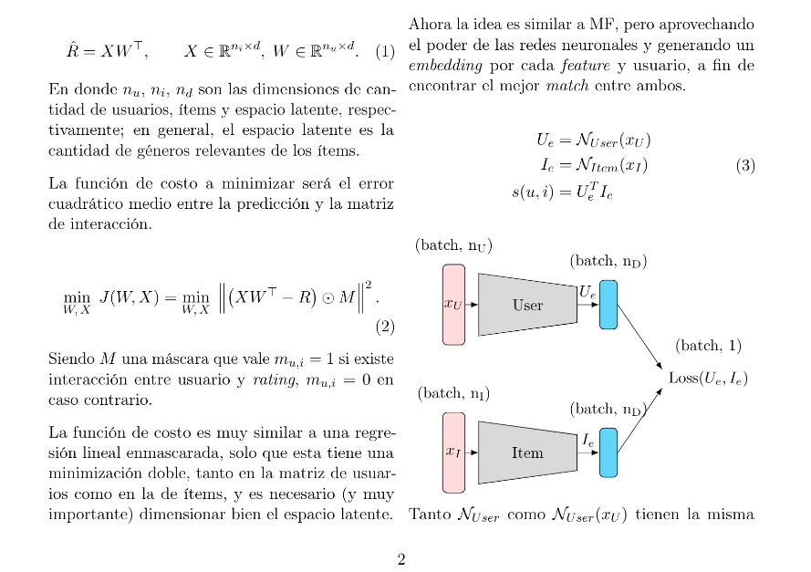

# Sistema de Recomendación - Implementación y Evaluación de Algoritmos Avanzados

Proyecto académico que implementa y compara diferentes técnicas de sistemas de recomendación aplicadas a datasets de películas o series de anime. Este trabajo explora desde métodos clásicos de factorización de matrices hasta arquitecturas modernas de deep learning.

## Objetivo del Proyecto

Diseñar, implementar y evaluar sistemas de recomendación de los cuales se seleccionaron dos:
- **Matrix Factorization** - Técnica clásica de filtrado colaborativo
- **Two-Tower Model** - Arquitectura moderna de deep learning para recomendaciones

## Preprocesamiento de Datos de Anime

### Limpieza y Filtrado de Datos
- **Eliminación de duplicados**: Se removieron calificaciones duplicadas usuario-anime conservando la primera ocurrencia
- **Filtrado por variabilidad**: Se seleccionaron usuarios con variabilidad de calificaciones mayor a 3 puntos para asegurar calidad en los datos
- **Filtrado por actividad**: Se aplicaron percentiles (20%-80%) para eliminar usuarios con muy pocas o demasiadas calificaciones
- **Limpieza de géneros**: Normalización de strings y eliminación de caracteres especiales

### Procesamiento de Géneros
- **Unificación de géneros**: Se combinaron las columnas `genres` y `genres_detailed` para maximizar información
- **Selección por percentiles**: Se seleccionaron géneros representativos usando percentiles (80%-90%) para evitar dimensionalidad excesiva
- **Filtrado de frecuencia**: Se mantuvieron géneros con frecuencia suficiente para ser estadísticamente significativos
- **Encoding flexible**: Se prepararon los datos para múltiples estrategias de encoding (One-Hot, embeddings)

### Procesamiento con Spark
Debido al volumen de datos (148M+ calificaciones), se utilizó Apache Spark para:
- Manejo eficiente de grandes volúmenes de datos
- Procesamiento distribuido para operaciones de agregación
- Optimización de memoria mediante formato Parquet

## Modelos Implementados

### 1. Matrix Factorization
**Descripción**: Técnica clásica de filtrado colaborativo que descompone la matriz usuario-item en factores latentes.

**Implementación**:
- Dimensión latente: 15 features
- Optimización mediante descenso de gradiente estocástico
- Regularización L2 para evitar overfitting
- Función de costo: Error cuadrático medio con regularización

**Formulación matemática**:
$$
min Σ(w^j · x^i + b^j - y^(i,j))^2 + λ(Σ||w^j||^2 + Σ||x^i||^2)
$$

### 2. Two-Tower Model
**Descripción**: Arquitectura de deep learning con dos torres independientes que aprenden representaciones vectoriales de usuarios e ítems.

**Características**:
- Torre de usuarios: Procesa características y preferencias del usuario
- Torre de ítems: Procesa características del contenido (géneros, tipo, año, etc.)
- Similitud: Se calcula mediante producto punto o similitud coseno entre embeddings
- Entrenamiento: Learning-to-rank con negative sampling

## Métricas de Evaluación Obtenidas

### Matrix Factorization
- **MSE**: 13.73
- **RMSE**: 3.70
- **MAE**: 3.53

### Métricas de Ranking (implementadas)
- **Precision@K**: Precisión en las primeras K recomendaciones
- **Recall@K**: Cobertura de ítems relevantes en las primeras K recomendaciones
- **Hit Rate@K**: Tasa de aciertos en las primeras K recomendaciones
- **NDCG@K**: Normalized Discounted Cumulative Gain
- **MAP@K**: Mean Average Precision


## Referencia Académica

Para detallar la implementación, metodología y resultados completos:



[Ver Paper Completo: Diseño y evaluación de un sistema de recomendación con MF y TwoTower](./TPfinalNN_BrianFuentes_101785.pdf)

Este trabajo se centra en el desarrollo y evaluación comparativa de dos modelos principales para sistemas de recomendación:

### Modelos Principales Estudiados
- **Matrix Factorization (MF)**: Enfoque clásico de filtrado colaborativo
- **Two Tower Model**: Arquitectura moderna de deep learning

El sistema fue evaluado exhaustivamente utilizando datasets de animes ([User Animelist Dataset](https://www.kaggle.com/datasets/ramazanturann/user-animelist-dataset)) con más de 148 millones de calificaciones.

El procesamiento con Spark permitió manejar eficientemente datasets a gran escala mientras mantenía la calidad de los datos mediante filtrado estadístico.


## Tecnologías Utilizadas

- **Python**            - Lenguaje principal
- **PyTorch**           - Framework de deep learning
- **Apache Spark**      - Procesamiento distribuido de
 grandes datos
- **NumPy/Pandas**      - Procesamiento de datos
- **Scikit-learn**      - Métricas de evaluación
- **Jupyter Notebooks** - Desarrollo y experimentación

## Estructura del Proyecto

```
├── sysrec/           # Módulo principal del sistema
│   ├── model.py      # Definición de modelos
│   ├── evaluate.py   # Métricas de evaluación
│   └── utils.py      # Funciones auxiliares
├── code/notebooks/   # Notebooks de experimentación
├── models/          # Modelos pre-entrenados
└── data/            # Datasets utilizados
```

---

Proyecto desarrollado como trabajo final para el curso de Redes Neuronales, demostrando dominio en algoritmos clásicos y modernos de recommendation systems, procesamiento de datos a gran escala y evaluación comprehensiva de sistemas de recomendación.

